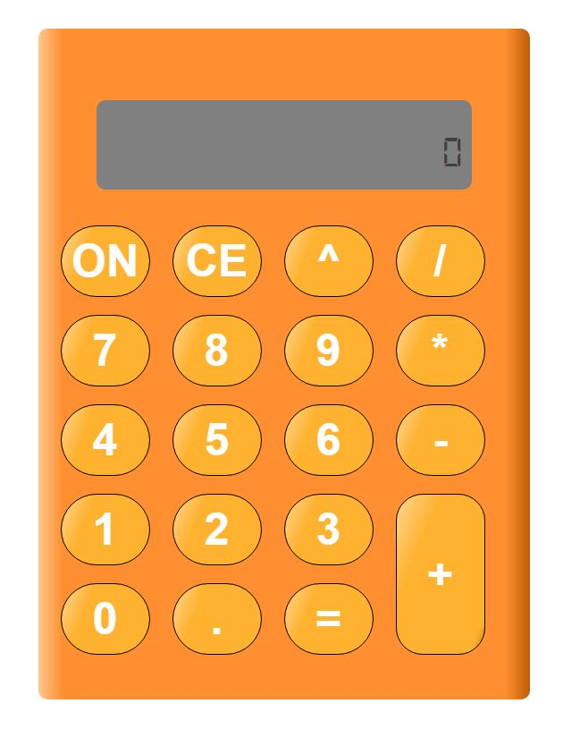
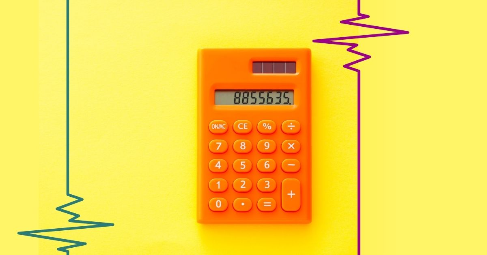

## JavaScript Calculator

This project task was to create a functioning calculator based off an image of an existing calculator. Below is an image of the finished project and then an image of the reference used.

## Finished Product

## Reference Image

## Approach

For the design of this calculator I used a grid of buttons inside a flex box to center. InnerHTML was used to write the button faces and were styled with CSS.

For the calculator functions, I decided to create a class and created functions within the class that can be accessed.

I handled inputs using innerHTML and an event listener. Each subset of buttons had their own class which let me use a 'forEach' to gather inputs from all categories without needing to write unique lines of code for each individual button. (numbers, operators, equals, clear)
